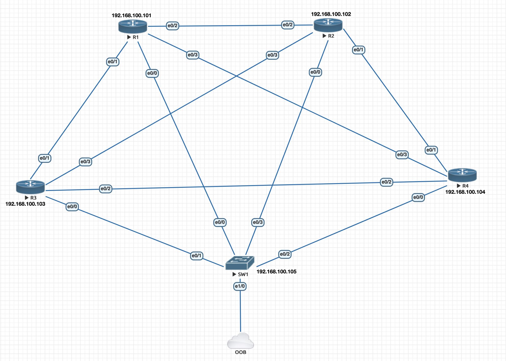
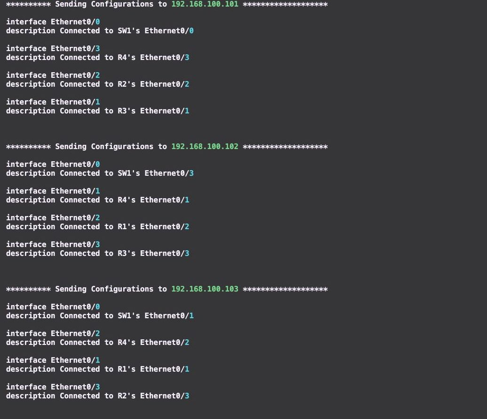
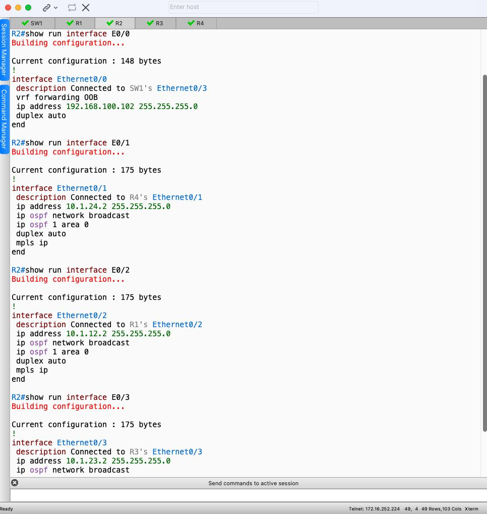

## Interface Description Named with Scrapli

This program automates the process of updating the description on every port by collecting cdp neighbor information from all ports and configuring the collected hostname information on the corresponding interface (including Port-channel). The program also supports parallel updates on multiple devices, making it possible to execute the program on numerous devices simultaneously.

